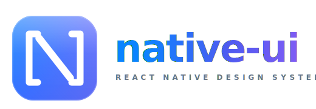

<p align="center">
  
</p>

<p align="center">
  <a href="https://www.npmjs.com/package/@polprog/native-ui"></a>
  <a href="LICENSE"></a>
  
  <a href="https://github.com/POLPROG-TECH/native-ui/actions"></a>
  <a href="https://POLPROG-TECH.github.io/native-ui"></a>
  
</p>

<p align="center">
  <b>Production-grade React Native design system with native-feeling components on iOS and Android.</b><br>
  <sub>Design tokens . Primitives . 23 components . Dark mode . A11y-first . Zero-config theming</sub>
</p>

<p align="center">
  <a href="#what-is-native-ui">About</a> .
  <a href="#quick-start">Quick Start</a> .
  <a href="#components">Components</a> .
  <a href="#theming">Theming</a> .
  <a href="#storybook">Storybook</a> .
  <a href="#development">Development</a> .
  <a href="#license">License</a>
</p>

---

## What is native-ui?

`@polprog/native-ui` is a production-grade React Native component library and
design system. Components are tuned to the platform defaults of iOS and Android
so that any app built on top gets a native look and feel out of the box.

| Area | What you get |
|------|--------------|
| **Tokens** | Colours (light + dark + high-contrast), typography scale (SF Pro / Roboto), spacing (4-pt grid), radius, shadow, motion, haptics |
| **Primitives** | `Box`, `VStack`, `HStack`, `Text`, `Heading`, `Divider`, `PressableScale` |
| **Components** | Button, Card, Checkbox, Chip, HeaderBar, IconButton, Input, ListItem, ListSection, ListSwitchItem, Radio, ScreenContainer, SearchBar, Section, SettingsRow, Select, Skeleton, Spinner, Switch, TextArea, Toast, Avatar, InputPrompt |
| **Theming** | `NativeUIProvider`, colour presets, system dark mode, font-scale tiers, runtime config |
| **Platforms** | iOS 13+ and Android 6+ (React Native 0.74+). All components render and behave natively on both. |
| **Output** | ESM + CJS + `.d.ts`, tree-shakeable, zero runtime dependencies beyond peers |

## Quick Start

```bash
npm install @polprog/native-ui react-native-reanimated react-native-safe-area-context
```

```tsx
import { NativeUIProvider, Button, VStack, Text } from '@polprog/native-ui';

export default function App() {
  return (
    <NativeUIProvider config={{ colorMode: 'system', preset: 'default' }}>
      <VStack spacing="md" padding="lg">
        <Text variant="largeTitle">Hello, native-ui</Text>
        <Button onPress={() => {}}>Get started</Button>
      </VStack>
    </NativeUIProvider>
  );
}
```

## Components

Browse the full catalogue with live examples, accessibility notes, and code
snippets in [**Storybook**](https://POLPROG-TECH.github.io/native-ui).

## Theming

Every component reads from a single theme object resolved by `NativeUIProvider`.
Config is fully optional - defaults match the native platform on iOS 17 / Android 14.

```tsx
<NativeUIProvider
  config={{
    colorMode: 'system',          // 'light' | 'dark' | 'system'
    preset: 'default',            // 'default' | 'ocean' | 'forest' | 'sunset' | ...
    fontScale: 'regular',         // 'small' | 'regular' | 'large' | 'xlarge'
    highContrast: false,
  }}
>
  <App />
</NativeUIProvider>
```

Access the theme anywhere with hooks:

```tsx
const { colors, spacing, typography } = useTheme();
const semantic = useSemantic();     // { background, surface, primary, ... }
```

## Storybook

Storybook hosts the full component gallery, interactive controls, and design
token documentation. It auto-deploys to GitHub Pages on every push to `master`.

Live: **<https://POLPROG-TECH.github.io/native-ui>**

Run locally:

```bash
npm install
npm run storybook
```

## Development

```
Libraries/Native-UI/
├── packages/
│   └── native-ui/              The published library (@polprog/native-ui)
│       ├── src/                Tokens, primitives, components, theme
│       ├── __tests__/          Jest + @testing-library/react-native (188 tests)
│       ├── stories/            Storybook stories (source of truth for docs)
│       └── docs/               ARCHITECTURE.md, CONTRIBUTING.md
├── apps/
│   └── storybook/              Storybook host app (deploys to GitHub Pages)
├── .changeset/                 Versioning + changelog automation
└── .github/workflows/          CI, release, deploy-storybook
```

Common tasks:

```bash
npm install                                              # Bootstrap workspace
npm run typecheck --workspace=@polprog/native-ui         # TypeScript strict
npm run lint      --workspace=@polprog/native-ui         # ESLint
npm run test      --workspace=@polprog/native-ui         # Jest (188 tests)
npm run build     --workspace=@polprog/native-ui         # tsup - ESM + CJS + d.ts
npm run storybook                                        # Dev Storybook on :6006
npm run build-storybook                                  # Static build
```

## Releasing

Releases are automated via [Changesets](https://github.com/changesets/changesets):

```bash
npx changeset            # Describe the change (patch / minor / major)
git commit && git push   # Open PR. On merge, release.yml publishes to npm with provenance.
```

## License

[MIT](LICENSE) (c) [POLPROG](https://polprog.pl/)
